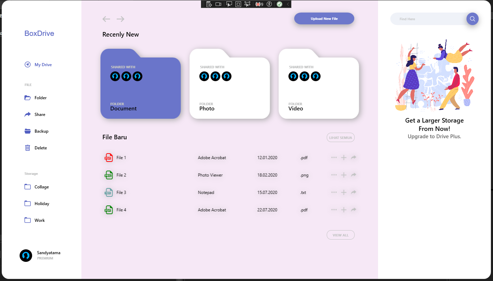

# MediaCaptureApp

<h2>Membuat Aplikasi Media Capture Sederhana Menggunakan Bahasa C#<h2>

## Nama : Sandyatama Fransisna Nugraha
## NRP: 5025211196
## Kelas : PBKK B
## Tahun : 2023

 

## Ini adalah tugas keempat untuk melakukan pembuatan aplikasi dashboard dari mata kuliah Pemrogaman Berbasis Kerangka Kerja untuk mempratekkan penggunaan framework .NET WPF dengan menggunakan bahasa C#. 

## Dashboard ini yang dibuat adalah aplikasi sederhana yang berisikan tampilan visual dashboard sederhana.

### 1. Hasil Program

